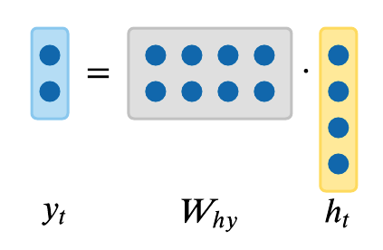

================================================
Introduction to Recurrent Neural Networks (RNNs)
================================================

.. admonition:: Prerequisite

    This article requires familiarity of basic Artificial Neural Network concepts, which are drawn from *Chapter 4 -
    Artificial Neural Networks* (p. 81) of `MACHINE LEARNING by Mitchell, Thom M. (1997)`_ Paperback. Please, if
    possible, read the chapter beforehand and refer to it if something looks confusing in the discussion of this section

.. contents:: Table of Contents
    :depth: 2

We all heard of this buz word "LLM" (Large Language Model). But let's put that aside for just a second and look at a
much simpler one called "character-level language model" where, for example, we input a prefix of a word such as
"hell" and the model outputs a complete word "hello". That is, this language model predicts the next character of a
character sequence

This is like a Math function where we have:

    f("hell") = "hello"

.. NOTE::

    We call inputs like "hell" as **sequence**

How do we obtain a function like this? One approach is to have 4 black boxes, each of which takes a single character as
input and calculates an output:

.. figure:: ../img/rnn-4-black-boxes.png
    :align: center
    :width: 50%

But one might have noticed that if the 3rd function (box) produces `f('l') = 'l'`, why would the 4th function
(box), given the same input, outputs something different (`'o'`)? That's a great catch. Maybe we should take the
"**history**" into account. Instead of having :math:`f` depend on 1 parameter, we now have it take 2 parameters. 1: a
character; 2: a variable that summarizes the previous calculations:

.. figure:: ../img/rnn-4-black-boxes-connected.png
    :align: center
    :width: 50%

Now it makes much more sense with:

    f('l', h2) = 'l'

    f('l', h3) = 'o'

But what if we want to predict a longer word? For example, how about predicting "learning" by "learnin"? That's simple,
we will have 7 black boxes to do the work

This is the idea behind RNN. Each function :math:`f` is a network unit containing 2 perceptrons.

One perceptron computes the "history" like :math:`h1`, :math:`h2`, :math:`h3`. Its formula is very similar to
that of perceptron:

.. math::

    h_t = g_1\left( W_{hh}h_{t - 1} + W_{xh}x_t + b_h \right)

where :math:`t` is the index of the "black boxes" shown above. In our example of "hell",
:math:`t \in \{ 1, 2, 3, 4 \}`

The other perceptron computes the output like 'e', 'l', 'l', 'o'. We call those value :math:`y` which is computed as

.. math::

    y_t = g_2\left( W_{hy}h_t + b_y \right)

.. admonition:: What are :math:`g_1` and :math:`g_2`?

    They are *activation functions* which are used to change the linear function in a perceptron to a non-linear
    function. Please refer to `MACHINE LEARNING by Mitchell, Thom M. (1997)`_ Paperback (page 96) for more details

    A typical activation function is :math:`tanh`:

    .. math::

        tanh(x) = \frac{e^x - e^{-x}}{e^x + e^{-x}}

*Training a RNN model is the same thing as searching for the optimal values for the following parameters of these two
perceptrons*:

1. :math:`W_{xh}`
2. :math:`W_{hh}`
3. :math:`W_{hy}`
4. :math:`b_h`
5. :math:`b_y`

To summarize, we have a RNN model defined by

.. math::

    h_t = \tanh\left( W_{hh}h_{t - 1} + W_{xh}x_t \right)

.. math::

    y_t = W_{hy}h_t

.. figure:: ../img/vanilla-rnn-mformula-1.png
    :align: center

Loss Function of RNN
--------------------

According to the discussion of `MACHINE LEARNING by Mitchell, Thom M. (1997)`_, the key for training RNN or any neural
network is through "specifying a measure for the training error". We call this measure a *loss function*. A common
choice of loose function, which we will be using in Lamassu for RNN, is *softmax*. We are going to show that Softmax
Loss is actually a *Softmax Activation* plus a *Cross-Entropy Loss*.

The softmax function takes as input a vector :math:`x` of :math:`K` real numbers, and normalizes it into a probability
distribution consisting of :math:`K` probabilities proportional to the exponentials of the input numbers. That is, prior
to applying softmax, some vector components could be negative, or greater than one; and might not sum to 1; but after
applying softmax, each component will be in the interval :math:`(0, 1)` and the components will add up to 1, so that
they can be interpreted as probabilities. Furthermore, the larger input components will correspond to larger
probabilities.

For a vector :math:`x` of :math:`K` real numbers, the the standard (unit) softmax function
:math:`\sigma: \mathbb{R}^K \mapsto (0, 1)^K`, where :math:`K \ge 1` is
`defined by <https://en.wikipedia.org/wiki/Softmax_function>`_:

.. math::

    \sigma(\vec{x})_i = \frac{e^{x_i}}{\sum_{j = 1}^Ke^{x_j}}

where :math:`i = 1, 2, ..., K` and :math:`\vec{x} = (x_1, x_2, ..., x_K) \in \mathbb{R}^K`

This property of softmax function that it outputs a probability distribution makes it suitable for probabilistic
interpretation in classification tasks. Neural networks, however, are commonly trained under a log loss (or
cross-entropy) regime

For the ease of the following discussion, we denote :math:`\sigma` as :math:`q`. Hence our softmax function for the
discussion becomes

.. math::

    \vec{q}\left( \vec{x} \right) = \left( \frac{e^{x_1}}{\sum_{j = 1}^Ke^{x_j}}, \frac{e^{x_2}}{\sum_{j = 1}^Ke^{x_j}}, ..., \frac{e^{x_K}}{\sum_{j = 1}^Ke^{x_j}} \right)

Cross-Entropy
"""""""""""""

From `Wikipedia <https://en.wikipedia.org/wiki/Cross-entropy>`_:

    In information theory, the cross-entropy between two probability distributions :math:`p` and :math:`q` over the same
    underlying set of events measures the average number of bits needed to identify an event drawn from the set if a
    coding scheme used for the set is optimized for an estimated probability distribution :math:`q`, rather than the
    true distribution :math:`p`

Confused? Let's put it in the context of Machine Learning.

Machine Learning sees the world based on probability. The "probability distribution" identifies the various tasks to
learn. For example, a daily language such as English or Chinese, can be seen as a probability distribution. The
probability of "name" followed by "is" is far greater than "are" as in "My name is Jack". We call such language
distribution :math:`p`. The task of RNN (or Machine Learning in general) is to learn an approximated distribution of
:math:`p`; we call this approximation :math:`q`

"The average number of bits needed" is can be seen as the distance between :math:`p` and :math:`q` given an event. In
analogy of language, this can be the *quantitative* measure of the deviation between a real language phrase
"My name is Jack" and "My name are Jack".

At this point, it is easy to image that, in the Machine Learning world, the cross entropy indicates the distance between
what the model believes the output distribution should be and what the original distribution really is.

Now we have an intuitive understanding of cross entropy, let's formally define it.

The cross-entropy of the distribution :math:`q` relative to a distribution :math:`p` over a given set is defined as

.. math::

    H(p, q) = -E_p\left[ \log q \right]

where :math:`E_p[]` is the expected value operator with respect to the distribution :math:`p`.

For discrete probability distributions :math:`p` and :math:`q`, we have

.. math::

    H(p, q) = -\sum_x p(\vec{x})\log q(\vec{x})

This is our ** softmax loss function for RNN**

.. NOTE::

    In the case of a recurrent neural network, we are essentially backpropagation through time, which means that we are
    forwarding through entire sequence to compute losses, then backwarding through entire sequence to compute gradients.
    This is why the loss function of RNN is in a summation form above.

Deriving Gradient Descent Weight Update Rule
^^^^^^^^^^^^^^^^^^^^^^^^^^^^^^^^^^^^^^^^^^^^

However, this becomes problematic when we want to train a sequence that is very long. For example, if we were to train a
a paragraph of words, we have to iterate through many layers before we can compute one simple gradient step. In
practice, for the back propagation, we examine how the output at the very *last* timestep affects the weights at the
very first time step. Then we can compute the gradient of loss function, the details of which can be found in the
`Vanilla RNN Gradient Flow & Vanishing Gradient Problem`_

.. admonition:: Gradient Clipping

    Gradient clipping is a technique used to cope with the `exploding gradient`_ problem sometimes encountered when
    performing backpropagation. By capping the maximum value for the gradient, this phenomenon is controlled in
    practice.

    .. figure:: ../img/gradient-clipping.png
        :align: center

    In order to remedy the vanishing gradient problem, specific gates are used in some types of RNNs and usually have a
    well-defined purpose. They are usually noted :math:`\Gamma` and are defined as

    .. math::

        \Gamma = \sigma(Wx^{<t>} + Ua^{<t - 1>} + b)

    where :math:`W`, :math:`U`, and :math:`b` are coefficients specific to the gate and :math:`\sigma` is the sigmoid
    function

LSTM Formulation
^^^^^^^^^^^^^^^^

Now we know that Vanilla RNN has Vanishing/exploding gradient problem, `LSTM Formulation`_ discusses the theory of LSTM
which is used to remedy this problem.

Applications of RNNs
--------------------

RNN models are mostly used in the fields of natural language processing and speech recognition. The different
applications are summed up in the table below:

.. list-table:: Applications of RNNs
   :widths: 20 60 20
   :align: center
   :header-rows: 1

   * - Type of RNN
     - Illustration
     - Example
   * - | One-to-one
       | :math:`T_x = T_y = 1`
     - .. figure:: ../img/rnn-one-to-one-ltr.png
     - Traditional neural network
   * - | One-to-many
       | :math:`T_x = 1`, :math:`T_y > 1`
     - .. figure:: ../img/rnn-one-to-many-ltr.png
     - Music generation
   * - | Many-to-one
       | :math:`T_x > 1`, :math:`T_y = 1`
     - .. figure:: ../img/rnn-many-to-one-ltr.png
     - Sentiment classification
   * - | Many-to-many
       | :math:`T_x = T_y`
     - .. figure:: ../img/rnn-many-to-many-same-ltr.png
     - Named entity recognition
   * - | Many-to-many
       | :math:`T_x \ne T_y`
     - .. figure:: ../img/rnn-many-to-many-different-ltr.png
     - Machine translation

.. rubric:: Footnotes

.. _`exploding gradient`: https://qubitpi.github.io/stanford-cs231n.github.io/rnn/#vanilla-rnn-gradient-flow--vanishing-gradient-problem

.. _`MACHINE LEARNING by Mitchell, Thom M. (1997)`: https://a.co/d/bjmsEOg

.. _`loss function`: https://qubitpi.github.io/stanford-cs231n.github.io/neural-networks-2/#losses
.. _`LSTM Formulation`: https://qubitpi.github.io/stanford-cs231n.github.io/rnn/#lstm-formulation

.. _`Vanilla RNN Gradient Flow & Vanishing Gradient Problem`: https://qubitpi.github.io/stanford-cs231n.github.io/rnn/#vanilla-rnn-gradient-flow--vanishing-gradient-problem
