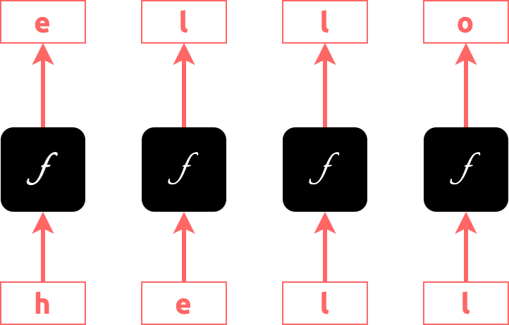
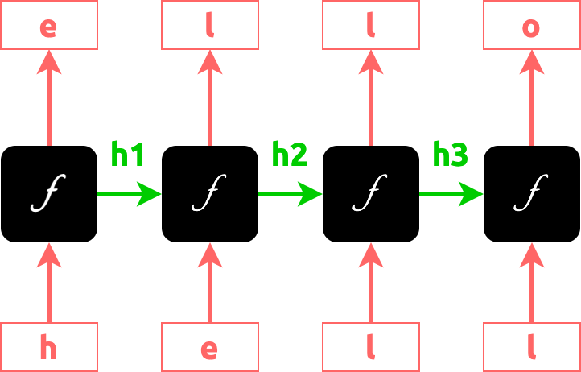
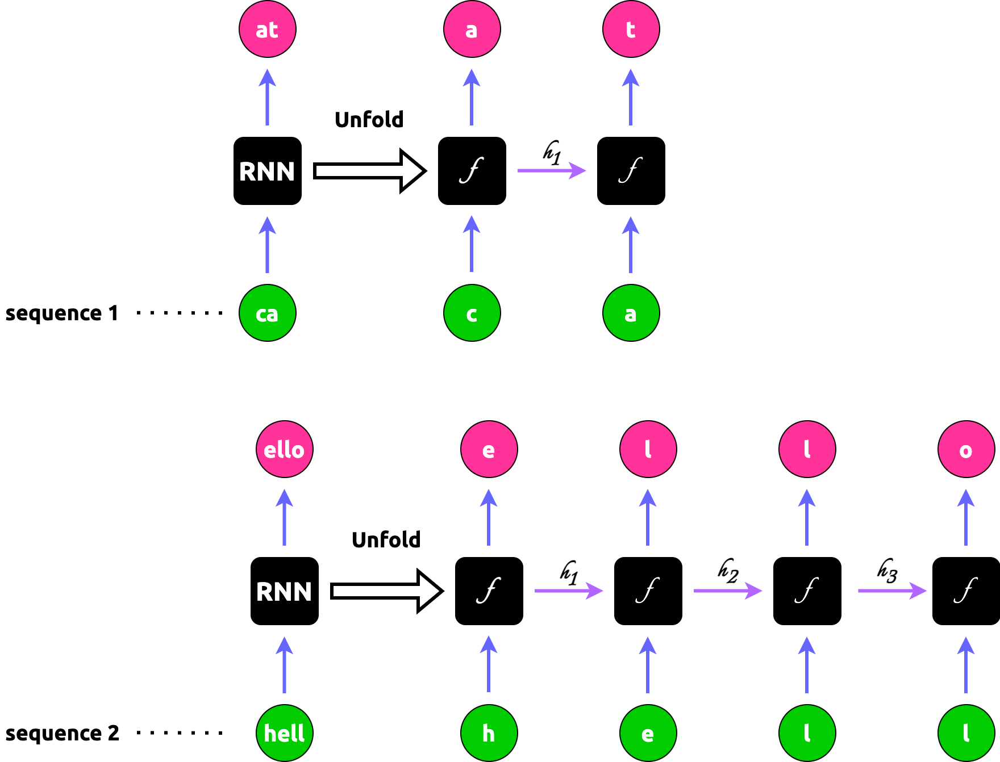
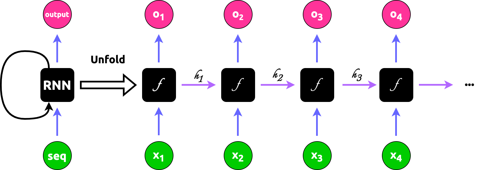

================================================
Introduction to Recurrent Neural Networks (RNNs)
================================================

.. admonition:: Prerequisite

    This article requires familiarity of basic Artificial Neural Network concepts, which are drawn from *Chapter 4 -
    Artificial Neural Networks* (p. 81) of `MACHINE LEARNING by Mitchell, Thom M. (1997)`_ Paperback. Please, if
    possible, read the chapter beforehand and refer to it if something looks confusing in the discussion of this section

.. contents:: Table of Contents
    :depth: 2

We all heard of this buz word "LLM" (Large Language Model). But let's put that aside for just a second and look at a
much simpler one called "character-level language model" where, for example, we input a prefix of a word such as
"hell" and the model outputs a complete word "hello". That is, this language model predicts the next character of a
character sequence

This is like a Math function where we have:

    f("hell") = "hello"

.. NOTE::

    We call inputs like "hell" as **sequence**

How do we obtain a function like this? One approach is to have 4 black boxes, each of which takes a single character as
input and calculates an output:

But one might have noticed that if the 3rd function (box) produces `f('l') = 'l'`, why would the 4th function
(box), given the same input, outputs something different (`'o'`)? That's a great catch. Maybe we should take the
"**history**" into account. Instead of having :math:`f` depend on 1 parameter, we now have it take 2 parameters. 1: a
character; 2: a variable that summarizes the previous calculations:

Now it makes much more sense with:

    f('l', h2) = 'l'

    f('l', h3) = 'o'

But what if we want to predict a longer or shorter word? For example, how about predicting "cat" by "ca"? That's simple,
we will have 2 black boxes to do the work.

What if the function :math:`f` is not smart enough to produce the correct output everytime? We will simply collect a lot
of examples such as "cat" and "hello", feed them into the boxes to train them until they can output correct vocabulary
like "cat" and "hello".

This is the idea behind RNN

- It's recurrent because the boxed function gets invoked repeatedly for each element of the sequence. In the case of our
  character-level language model, element is a character such as "e" and sequence is a string like "hell"

Each function :math:`f` is a network unit containing 2 perceptrons.

One perceptron computes the "history" like :math:`h_1`, :math:`h_2`, :math:`h_3`. Its formula is very similar to
that of perceptron:

.. math::

    h_t = g_1\left( W_{hh}h_{t - 1} + W_{xh}x_t + b_h \right)

where :math:`t` is the index of the "black boxes" shown above. In our example of "hell",
:math:`t \in \{ 1, 2, 3, 4 \}`

The other perceptron computes the output like 'e', 'l', 'l', 'o'. We call those value :math:`y` which is computed as

.. math::

    y_t = g_2\left( W_{hy}h_t + b_y \right)

.. admonition:: What are :math:`g_1` and :math:`g_2`?

    They are *activation functions* which are used to change the linear function in a perceptron to a non-linear
    function. Please refer to `MACHINE LEARNING by Mitchell, Thom M. (1997)`_ Paperback (page 96) for more details

    A typical activation function is :math:`tanh`:

    .. math::

        tanh(x) = \frac{e^x - e^{-x}}{e^x + e^{-x}}

    In practice, :math:`g_2` is constance so our model becomes

    .. math::

        h_t = tanh\left( W_{hh}h_{t - 1} + W_{xh}x_t + b_h \right)

    .. math::

        y_t = \left( W_{hy}h_t + b_y \right)

Loss Function of RNN
--------------------

According to the discussion of `MACHINE LEARNING by Mitchell, Thom M. (1997)`_, the key for training RNN or any neural
network is through "specifying a measure for the training error". We call this measure a *loss function*. A common
choice of loose function, which we will be using in Lamassu for RNN, is *softmax*. We are going to show that Softmax
Loss is actually a *Softmax Activation* plus a *Cross-Entropy Loss*.

Softmax Function
^^^^^^^^^^^^^^^^

.. admonition:: Softmax Function by `Wikipedia <https://en.wikipedia.org/wiki/Softmax_function>`_

    The softmax function takes as input a vector :math:`z` of :math:`K` real numbers, and normalizes it into a
    probability distribution consisting of :math:`K` probabilities proportional to the exponentials of the input
    numbers. That is, prior to applying softmax, some vector components could be negative, or greater than one; and
    might not sum to 1; but after applying softmax, each component will be in the interval :math:`(0, 1)` and the
    components will add up to 1, so that they can be interpreted as probabilities. Furthermore, the larger input
    components will correspond to larger probabilities.

    For a vector :math:`z` of :math:`K` real numbers, the the standard (unit) softmax function
    :math:`\sigma: \mathbb{R}^K \mapsto (0, 1)^K`, where :math:`K \ge 1` is defined by

    .. math::

        \sigma(\vec{z})_i = \frac{e^{z_i}}{\sum_{j = 1}^Ke^{z_j}}

    where :math:`i = 1, 2, ..., K` and :math:`\vec{x} = (x_1, x_2, ..., x_K) \in \mathbb{R}^K`

In the context of RNN,

.. math::

    \sigma(\vec{o})_i = \frac{e^{o_i}}{\sum_{j = 1}^ne^{o_j}}

where

- :math:`n` is the length of a sequence feed into the RNN
- :math:`o_i` is the output by perceptron unit `i`
- :math:`i = 1, 2, ..., n`,
- :math:`\vec{o} = (o_1, o_2, ..., o_n) \in \mathbb{R}^n`

The softmax function takes an N-dimensional vector of arbitrary real values and produces another N-dimensional vector
with real values in the range (0, 1) that add up to 1.0. It maps :math:`\mathbb{R} \rightarrow \mathbb{R}`

.. math::

     \sigma(\vec{o}): \begin{pmatrix} x_1\\x_2\\\dots\\x_n\end{pmatrix} \rightarrow \begin{pmatrix} \sigma_1\\\sigma_2\\\dots\\\sigma_n\end{pmatrix}

This property of softmax function that it outputs a probability distribution makes it suitable for probabilistic
interpretation in classification tasks. Neural networks, however, are commonly trained under a log loss (or
cross-entropy) regime

We are going to compute the derivative of the softmax function because we will be using it for training our RNN model
shortly. But before diving in, it is important to keep in mind that Softmax is fundamentally a vector function. It takes
a vector as input and produces a vector as output; in other words, it has multiple inputs and multiple outputs.
Therefore, we cannot just ask for "the derivative of softmax"; We should instead specify:

1. Which component (output element) of softmax we're seeking to find the derivative of.
2. Since softmax has multiple inputs, with respect to which input element the partial derivative is computed.

What we're looking for is the partial derivatives of

.. math::

    \frac{\partial \sigma_i}{\partial o_k} = \frac{\partial }{\partial o_k} \frac{e^{o_i}}{\sum_{j = 1}^ne^{o_j}}

We'll be using the quotient rule of derivatives. For :math:`h(x) = \frac{f(x)}{g(x)}` where both :math:`f` and :math:`g`
are differentiable and :math:`g(x) \ne 0`, The quotient rule states that the derivative of :math:`h(x)` is

.. math::

    h'(x) = \frac{f'(x)g(x) - f(x)g'(x)}{g^2(x)}

Cross-Entropy
"""""""""""""

From `Wikipedia <https://en.wikipedia.org/wiki/Cross-entropy>`_:

    In information theory, the cross-entropy between two probability distributions :math:`p` and :math:`q` over the same
    underlying set of events measures the average number of bits needed to identify an event drawn from the set if a
    coding scheme used for the set is optimized for an estimated probability distribution :math:`q`, rather than the
    true distribution :math:`p`

Confused? Let's put it in the context of Machine Learning.

Machine Learning sees the world based on probability. The "probability distribution" identifies the various tasks to
learn. For example, a daily language such as English or Chinese, can be seen as a probability distribution. The
probability of "name" followed by "is" is far greater than "are" as in "My name is Jack". We call such language
distribution :math:`p`. The task of RNN (or Machine Learning in general) is to learn an approximated distribution of
:math:`p`; we call this approximation :math:`q`

"The average number of bits needed" is can be seen as the distance between :math:`p` and :math:`q` given an event. In
analogy of language, this can be the *quantitative* measure of the deviation between a real language phrase
"My name is Jack" and "My name are Jack".

At this point, it is easy to image that, in the Machine Learning world, the cross entropy indicates the distance between
what the model believes the output distribution should be and what the original distribution really is.

Now we have an intuitive understanding of cross entropy, let's formally define it.

The cross-entropy of the discrete probability distribution :math:`q` relative to a distribution :math:`p` over a given
set is defined as

.. math::

    H(p, q) = -\sum_x p(x)\log q(x)

In RNN, the probability distribution of :math:`q(x)` is exactly the softmax function we defined earlier:

.. math::

    \mathcal{L} = -\sum_i t_i\log\sigma(\vec{o})_i = -\sum_i t_i\log\frac{e^{o_i}}{\sum_{j = 1}^ne^{o_j}}

where

- :math:`t` is the target sequence to predict and :math:`t_i` is the i-th element of the true sequence
- :math:`o` is the predicted sequence by RNN and :math:`o_i` is the i-th element of the predicted sequence

.. NOTE::

    The definition of :math:`\mathcal{L}` above

Deriving Gradient Descent Weight Update Rule
^^^^^^^^^^^^^^^^^^^^^^^^^^^^^^^^^^^^^^^^^^^^

Let's review what we have now, because we will be using all them to calculate the update rule:

.. math::

    h_t = tanh\left( W_{hh}h_{t - 1} + W_{xh}x_t + b_h \right)

.. math::

    y_t = \left( W_{hy}h_t + b_y \right)

.. math::

    \mathcal{L} = -\sum_i t_i\log\sigma(\vec{y})_i = -\sum_i t_i\log\frac{e^{y_i}}{\sum_{j = 1}^ne^{y_j}}

*Training a RNN model is the same thing as searching for the optimal values for the following parameters of these two
perceptrons*:

1. :math:`W_{xh}`
2. :math:`W_{hh}`
3. :math:`W_{yh}`
4. :math:`b_h`
5. :math:`b_y`

.. rubric:: Footnotes

.. _`exploding gradient`: https://qubitpi.github.io/stanford-cs231n.github.io/rnn/#vanilla-rnn-gradient-flow--vanishing-gradient-problem

.. _`MACHINE LEARNING by Mitchell, Thom M. (1997)`: https://a.co/d/bjmsEOg

.. _`loss function`: https://qubitpi.github.io/stanford-cs231n.github.io/neural-networks-2/#losses
.. _`LSTM Formulation`: https://qubitpi.github.io/stanford-cs231n.github.io/rnn/#lstm-formulation

.. _`Vanilla RNN Gradient Flow & Vanishing Gradient Problem`: https://qubitpi.github.io/stanford-cs231n.github.io/rnn/#vanilla-rnn-gradient-flow--vanishing-gradient-problem
