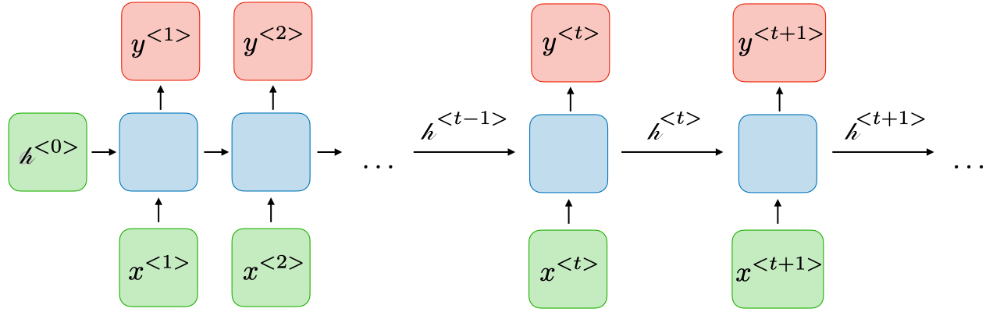
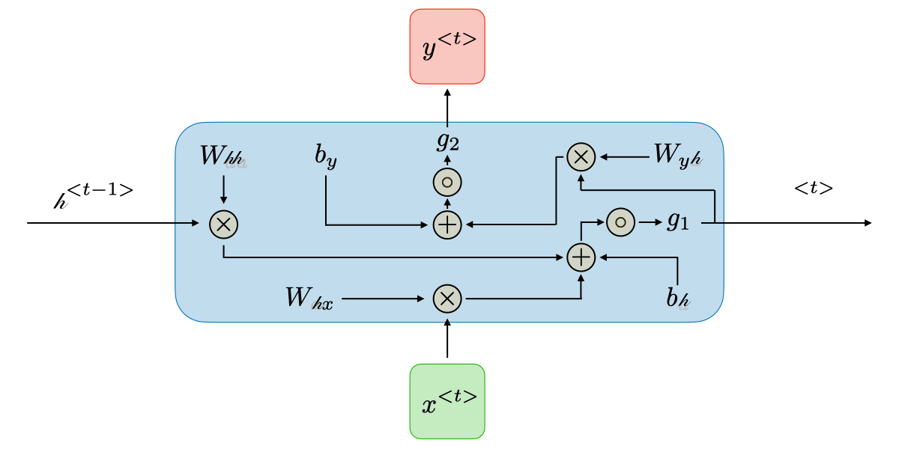

================================================
Introduction to Recurrent Neural Networks (RNNs)
================================================

.. contents:: Table of Contents
    :depth: 2

Mathematical Formulation
------------------------

Recurrent neural networks, also known as RNNs, are a class of neural networks that allow previous outputs to be used as
part of inputs while having hidden states. They are typically as follows:

For each timestep :math:`t` the activation and the output :math:`y_t` are expressed as follows:

.. math::

    h_t = g_1\left( W_{hh}h_{t - 1} + W_{xh}x_t + b_h \right)

    y_t = g_2\left( W_{hy}h_t + b_y \right)

where :math:`W_{xh}`, :math:`W_{hh}`, :math:`W_{hy}`, :math:`b_h`, :math:`b_y` are coefficients that are shared
temporally and :math:`g_1`, :math:`g_2` are activation functions. The diagram below visualizes the 2 formula above:

In the most simplest form of RNN, which we call a *Vanilla RNN*, the network is just a single hidden state :math:`h`
where we use a recurrence formula that basically tells us how we should update our hidden state :math:`h` with previous
hidden state :math:`h_{t - 1}` and the current input :math:`x_t`. In particular, we're going to have weight matrices
:math:`W_{hh}` and :math:`W_{xh}`. They will project both :math:`h_{t - 1}` and :math:`x_t`. Then they are summed and
non-linearnized with activation function to update the :math:`h_t` at timestep :math:`t`. This recurrence is telling us
how :math:`h` will change as a function of its history and also the current input at this timestep:

.. NOTE::
   A typical activation function is :math:`tanh(x) = \frac{e^x - e^{-x}}{e^x + e^{-x}}`

.. math::

    h_t = \tanh\left( W_{hh}h_{t - 1} + W_{xh}x_t \right)

.. figure:: ../img/vanilla-rnn-mformula-1.png
    :align: center

We base predictions on top of :math:`h_t` by using just another matrix projection on top of the hidden state. This is
the simplest complete case in which we can wire up a neural network:

.. math::

    y_t = W_{hy}h_t

Our target is to learn the following 3 weight matrices

.. figure:: ../img/vanilla-rnn-mformula-2.png
    :align: center

1. :math:`W_{xh}`
2. :math:`W_{hh}`
3. :math:`W_{hy}`

Initialization
--------------

Before training, we need to initialize the :math:`W`, :math:`b`, and, don't forget, :math:`h_0`, the initial hidden
state. Each of them can be initialized using either of the 2 approaches:

1. All-zero
2. Random

Common literature [#f1]_ [#f2]_ tends to initialize

* *small* random values to :math:`W`
* all-zero to :math:`b`

Training
--------

.. admonition:: Prerequisite

    This section requires familiarity of basic Artificial Neural Network concepts, which are drawn from *Chapter 4 -
    Artificial Neural Networks* (p. 81) of `MACHINE LEARNING by Mitchell, Thom M. (1997)`_ Paperback. Please, if
    possible, read the chapter beforehand and refer to it if something looks confusing in the discussion of this section

What is the Loss Function of RNN?
~~~~~~~~~~~~~~~~~~~~~~~~~~~~~~~~~

According to the discussion of Back `MACHINE LEARNING by Mitchell, Thom M. (1997)`_, the key for training RNN is through
"specifying a measure for the training error". We call this measure a *loss function*. As a loss function, which
measures training error, we could choose to have *softmax*

The softmax function is defined, mathematically, as

.. math::

    \sigma_i(\vec{z}) = \frac{e^{z_i}}{\sum_{j = 1}^{m}e^{z_j}}

where :math:`i = 1, 2, ..., m`

Its role in the Logistic regression is to translate the linear predictive value into category probability: Imagine Zi = Wi*x + Bi is the result of linear prediction, Softmax can make Zi nonnegative by letting them become exponential, then the sum of all items is normalized, now each Oi = σi (Z) can be interpreted as the probability of data x belong to the category i, or the likelihood.

In the case of a recurrent neural network, we are essentially backpropagation through time, which means that we are
forwarding through entire sequence to compute losses, then backwarding through entire sequence to compute gradients.
Formally, the `loss function`_ :math:`\mathcal{L}` of all time steps is defined as the sum of
the loss at every time step:

.. math::

    \mathcal{L}\left( \hat{y}, y \right) = \sum_{t = 1}^{T_y}\mathcal{L}\left( \hat{y}^{<t>}, y^{<t>} \right)

However, this becomes problematic when we want to train a sequence that is very long. For example, if we were to train a
a paragraph of words, we have to iterate through many layers before we can compute one simple gradient step. In
practice, for the back propagation, we examine how the output at the very *last* timestep affects the weights at the
very first time step. Then we can compute the gradient of loss function, the details of which can be found in the
`Vanilla RNN Gradient Flow & Vanishing Gradient Problem`_

.. admonition:: Gradient Clipping

    Gradient clipping is a technique used to cope with the `exploding gradient`_ problem sometimes encountered when
    performing backpropagation. By capping the maximum value for the gradient, this phenomenon is controlled in
    practice.

    .. figure:: ../img/gradient-clipping.png
        :align: center

    In order to remedy the vanishing gradient problem, specific gates are used in some types of RNNs and usually have a
    well-defined purpose. They are usually noted :math:`\Gamma` and are defined as

    .. math::

        \Gamma = \sigma(Wx^{<t>} + Ua^{<t - 1>} + b)

    where :math:`W`, :math:`U`, and :math:`b` are coefficients specific to the gate and :math:`\sigma` is the sigmoid
    function

LSTM Formulation
^^^^^^^^^^^^^^^^

Now we know that Vanilla RNN has Vanishing/exploding gradient problem, `LSTM Formulation`_ discusses the theory of LSTM
which is used to remedy this problem.

Applications of RNNs
--------------------

RNN models are mostly used in the fields of natural language processing and speech recognition. The different
applications are summed up in the table below:

.. list-table:: Applications of RNNs
   :widths: 20 60 20
   :align: center
   :header-rows: 1

   * - Type of RNN
     - Illustration
     - Example
   * - | One-to-one
       | :math:`T_x = T_y = 1`
     - .. figure:: ../img/rnn-one-to-one-ltr.png
     - Traditional neural network
   * - | One-to-many
       | :math:`T_x = 1`, :math:`T_y > 1`
     - .. figure:: ../img/rnn-one-to-many-ltr.png
     - Music generation
   * - | Many-to-one
       | :math:`T_x > 1`, :math:`T_y = 1`
     - .. figure:: ../img/rnn-many-to-one-ltr.png
     - Sentiment classification
   * - | Many-to-many
       | :math:`T_x = T_y`
     - .. figure:: ../img/rnn-many-to-many-same-ltr.png
     - Named entity recognition
   * - | Many-to-many
       | :math:`T_x \ne T_y`
     - .. figure:: ../img/rnn-many-to-many-different-ltr.png
     - Machine translation

.. rubric:: Footnotes

.. [#f1] https://lucyliu-ucsb.github.io/posts/Backpropagation-of-a-vanilla-RNN/#initialize-parameters
.. [#f2] https://gist.github.com/karpathy/d4dee566867f8291f086

.. _`exploding gradient`: https://qubitpi.github.io/stanford-cs231n.github.io/rnn/#vanilla-rnn-gradient-flow--vanishing-gradient-problem

.. _`MACHINE LEARNING by Mitchell, Thom M. (1997)`: https://a.co/d/bjmsEOg

.. _`loss function`: https://qubitpi.github.io/stanford-cs231n.github.io/neural-networks-2/#losses
.. _`LSTM Formulation`: https://qubitpi.github.io/stanford-cs231n.github.io/rnn/#lstm-formulation

.. _`Vanilla RNN Gradient Flow & Vanishing Gradient Problem`: https://qubitpi.github.io/stanford-cs231n.github.io/rnn/#vanilla-rnn-gradient-flow--vanishing-gradient-problem
